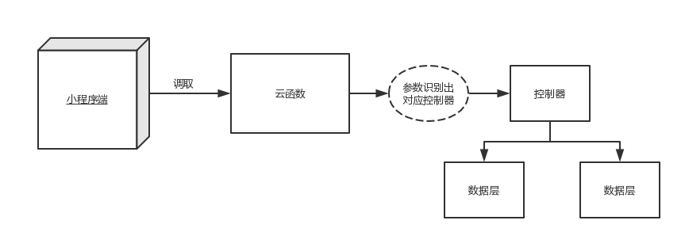

# 云开发-微博
## 文档结构
1. 云开发简介
2. 微博在云开发的实现
3. 杂要(黑科技)

## 云开发简介

### 搭建条件

1. 微信小程序的账号(不能测试号)
2. 基础库 2.2.3 开始支持

满足以上条件即可获取两个云端仓库

<br/>
<br/>

### 概要
***
官网简介:云开发为开发者提供完整的云端支持，弱化后端和运维概念，无需搭建服务器，使用平台提供的 API 进行核心业务开发，即可实现快速上线和迭代，同时这一能力，同开发者已经使用的云服务相互兼容，并不互斥。
***

**从简介中可以得出两个结论**:

1. 在无需搭建服务器，匹配(后端，运维)情况完成项目.
2. 可以使用自己的服务器与云开发共同搭建项目.

**实现这两个结论主要依靠云开发提供的三个功能**:

- 数据库：一个既可在小程序前端操作，也能在云函数中读写的 JSON 文档型数据库
- 文件存储：在小程序前端直接上传/下载云端文件，在云开发控制台可视化管理
- 云函数：在云端运行的代码，微信私有协议天然鉴权，开发者只需编写业务逻辑代码

<p style="font-size: 11px; color: #f04">*数据库和文件存储API在小程序前端和云函数有所区别</p>

<br/>
<br/>

### 快速开始
1. 下载新版本的微信开发者工具,点击图标
2. 填写仓库信息
	
3. project.config.json 中增加了字段 cloudfunctionRoot 用于指定存放云函数的目录

<br/>
<br/>
### 数据库
**云开发提供了一个 JSON 文档型数据库**

对应关系型的数据库可以这样理解:

- 数据库 database => 数据库 database
- 集合 collection => 表 table
- 记录 doc => 行 row
- 字段 field => 列 column


<br/>

**数据库提供以下功能**:

- 对数据的增、删、改、查,以及批量的删、改、查(只有云函数支持批量删除)
- 提供各种查询条件（不支持关联查询）
- 提供存储时间和地理位置的功能
- 提供索引

<br/>
<br/>

### 文件存储

**文件存储提供以下功能**:

- 提供上传、下载、删除API,(在云端上传不支持临时文件地址)
- 内置组件(image、video、cover-image)支持传入云文件id
- 云开发后台可以查看文件的详细信息、控制存储空间的读写权限


<br/>
<br/>

### 云函数
**云函数运行在node服务端的程序,提供以下功能**

- 可获取用户的OPENID, APPID, UNIONID(在满足 unionId 获取条件时返回)
- 云端后台提供测试、日志、监控功能
[文档](https://developers.weixin.qq.com/miniprogram/dev/wxcloud/guide/functions/console.html)
- 运行各种js新语法,使用各种插件

**一个云端仓库只能有20个云函数**

<br/>
<br/>

### 权限

[权限文档](https://developers.weixin.qq.com/miniprogram/dev/wxcloud/guide/database/permission.html)
<br/>
<br/>
## 微博在云开发的实现
微博现在主要有两个功能

1. 发布、删除、查看微博
2. 点赞列表和点赞、取消点赞

<br/>
<br/>

### 数据模块的架构
**数据层主要查分为两个部分**

1. 云端数据层,主要对数据库的操作
2. 小程序数据层,主要用于获取与存储数据

#### 云端数据层
在云函数中建立 controllers 和 models 两个文件夹,
controllers文件夹中放置控制器文件,用于操作业务逻辑,
models文件夹中放置数据层文件,用于操作数据库.

#### 小程序数据层
通过调用云函数通知云端数据层做相关操作,
然后把数据渲染在页面,或保存到数据管理工具中.
<p style="font-size: 11px; color: #f04">*可以在云函数基础上封装一层,用于统一处理请求逻辑</p>

示例图



<br/>
<br/>

### 微博创建
流程

1. 验证数据,通过后传参并调去云函数
2. 云函数调用对应的控制器
3. 控制器调去对应数据层把参数写入数据库

```
//miniprogram/pages/write/write.js
Page({
...
...
    submitHandle: function() {
    	 //验证数据
    	 if (isLoading || !this.submitValidator(logContent)) return;
        ...
        ...
        	  //传参并调去云函数
            return this.createBlogRequest({logContent, photoIds, userInfo});
        ...
        ...
    },
    createBlogRequest: function(data) {
        return wx.cloud.callFunction({
            name: 'api',
            data: {
                controller: 'BlogController',
                action: 'create',
                option: data
            }
        });
    }
    ...
    ...
});


//cloudfunctions/api/index.js
...
...
exports.main = (event) => {
	//获取小程序的参数
    const { controller, action, option } = event;
	//通过参数识别对应的控制器
    const _controller = require(path.join(__dirname, './controllers/' + controller));
	//获取微信sdk提供的鉴权
    const auth = cloud.getWXContext();
    //调用对应的控制器
    const data = _controller[action]( auth, option );
	 //返回数据
    return data;
};


//cloudfunctions/api/controllers/BlogController.js
//引入依赖
const LogsModel = require('../models/LogsModel');
...
...
const cloud = require('wx-server-sdk');

//初始化数据库
cloud.init();
const db = cloud.database();
const _ = db.command;

const BlogController = {
...
...
    /* option
    ** @key logContent {spring} 微博内容
    ** @key photoIds {array} 图片id的数组
    ** @key userInfo {Object} 用户信息
    */
    create: async function(auth, option) {
    	 //整理数据
        const { logContent, photoIds, userInfo } = option;
        const { OPENID } = auth;
        const createTime = db.serverDate(); //获取服务器时间
		 //调用model层
        const res = await LogsModel.create({ logContent, photoIds, userInfo, OPENID, createTime});
        return res;
    },
...
...
};


//cloudfunctions/api/models/LogsModel.js
const cloud = require('wx-server-sdk'); //引入sdk
//初始数据库
cloud.init();
const db = cloud.database();

const collection = 'logs';
const likeCollection = 'likes';
const LogsModel = {
...
...
    create: function(data) {
        return db.collection(collection).add({ data }); //插入文件
    },
...
...
};

```

在这里没有使用云端的API上传图片,
因为比较麻烦,直接在小程序端上传比较方便.
[云端上传图片文档](https://developers.weixin.qq.com/miniprogram/dev/wxcloud/reference-server-api/storage/uploadFile.html)
[小程序上传图片文档](https://developers.weixin.qq.com/miniprogram/dev/wxcloud/reference-client-api/storage/uploadFile.html)
[小程序读取文件文档](https://developers.weixin.qq.com/miniprogram/dev/api/file/FileSystemManager.readFileSync.html)


<br/>
<br/>

### 获取点赞列表
流程

1. 调用点赞列表的云函数
2. 云函数调用对应的控制器
3. 控制器通过 like模型层 获取当前用户所有点赞的日志id
4. 在通过 log数据层 使用 in 条件把日志表里配备的日志查询出来
5. 取出数据并渲染

实现关联查询的图解


使用索引优化性能


<br/>
<br/>

### 数据的响应
当在微博列表里取消对自身微博的点赞是
在个人中心的点赞数要做对应的响应

<video src="./images/share8.mp4" width="300px" autoplay="autoplay"></video>


这个功能借鉴了vue BUS 的思想

```
//miniprogram/utils/bus.js
class Bus {
    static getInstance() {
        if (!Bus.instance) {
            Bus.instance = new Bus();
        }
        return Bus.instance;
    }

    constructor() {
        this._watcher = {};
    }

    on(name, handler) {
        if (!handler instanceof Function) {
            throw Error('第二个参数应该是函数,但获取的是' + typeof handler);
        }

        if (this._watcher[name]) {
            this._watcher[name].push(handler);
        } else {
            this._watcher[name] = [handler];
        }

        return this;
    }

    emit(name) {
        if (!this._watcher[name]) return;
        const args = Array.prototype.slice.call(arguments, 1);
        this._watcher[name].forEach(handler => {
            handler.apply(null, args);
        });

        return this;
    }
}


export default Bus.getInstance();


//miniprogram/pages/index/index.js
...
...
import bus from '../../utils/bus';

...
...

Page({
...
...


    likeBlogHandle: function(evt) {
        ...
        ...
        		//推送事件
            bus.emit('likeEvent', id, hasLike);
        ...
        ...
    },
});


//miniprogram/pages/my/my.js
...
...
    onLoad: function() {
		...
		...
		//监听事件
        bus.on('likeEvent', this.$OnLikeEvent)
            .on('mulLike', this.$OnMulLike);
    },

    //出发更新
    $OnLikeEvent: function(id, hasLike) {
        let likeCount = hasLike ? this.data.likeCount - 1 : this.data.likeCount + 1;
        this.setData({ likeCount });
    },
```

## 参考文档

- [云开发文档](https://developers.weixin.qq.com/miniprogram/dev/wxcloud/basis/getting-started.html)

